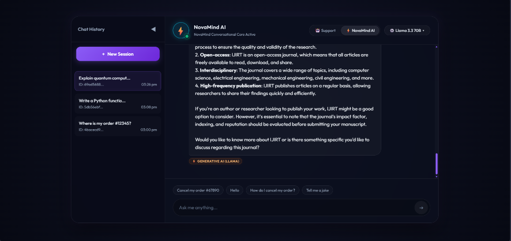
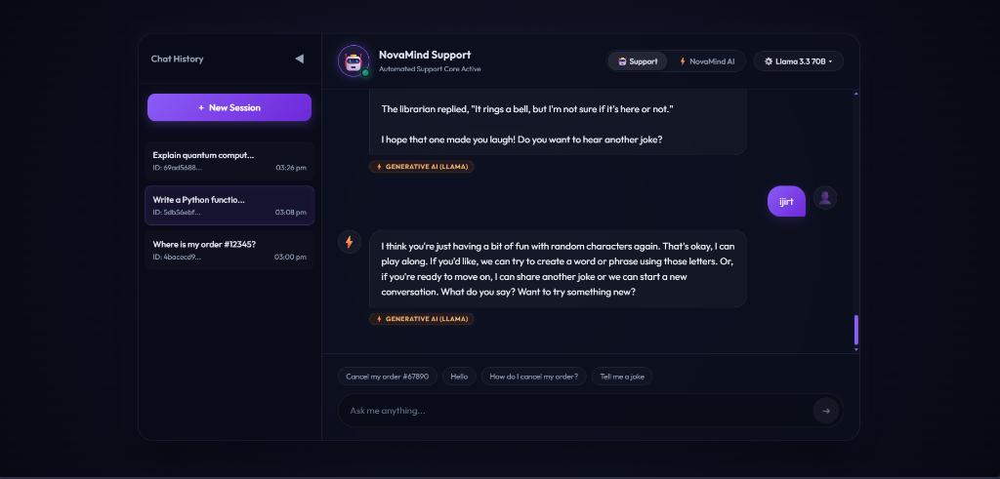
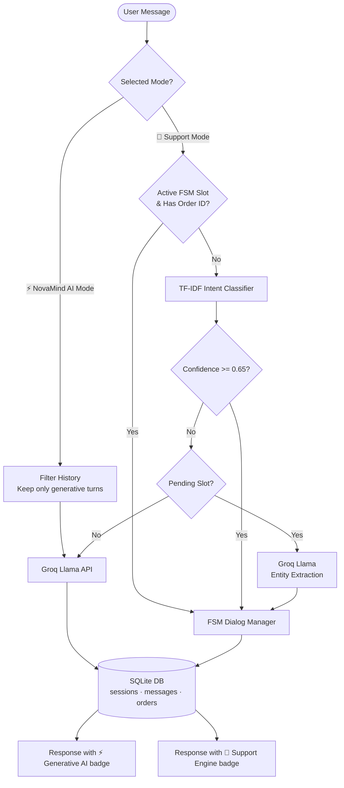

# 🌌 NovaMind: Hybrid AI & Customer Support Chatbot

<p align="center">
  
  
</p>

NovaMind is a dual-mode AI chatbot that combines a **deterministic customer support engine** with an **open-ended generative AI companion**. Transactional queries (order tracking, cancellations, refunds) are handled locally via TF-IDF intent classification and an FSM dialog manager backed by SQLite, while general questions are routed to Groq's Llama API. The frontend is a React SPA with a dark glassmorphism UI.

**Live Demo:** [ai-chatbot-kappa-black-54.vercel.app](https://ai-chatbot-kappa-black-54.vercel.app)

---

## How It Works



**Routing logic in plain English:**
1. If the user is in **NovaMind AI mode**, the message goes straight to Groq Llama. Support history is filtered out so the AI never leaks order numbers or support context into general conversation.
2. If the user is in **Support mode**, the message hits the TF-IDF classifier first. High-confidence support intents (greeting, goodbye, order tracking, cancellation, refund) are routed to the local FSM dialog manager. Everything else falls back to Groq Llama as a generative conversational assistant.
3. If the FSM is mid-conversation waiting for an order ID and the regex extractor fails, Groq Llama is used as a fallback entity extractor (JSON mode, temperature 0).

---

## Tech Stack

| Layer | Technology | Purpose |
|-------|-----------|---------|
| **Intent Classification** | Pure-Python TF-IDF + Cosine Similarity | Classifies user intent from ~150 training examples. Zero external ML dependencies. |
| **Dialog Management** | Custom FSM (Finite State Machine) | Manages multi-turn slot-filling flows for order tracking, cancellations, and refunds. |
| **Generative AI** | Groq Cloud API (Llama 3.3 70B / Llama 3.1 8B) | Handles general-purpose Q&A, coding, creative writing, and fallback responses. |
| **Database** | SQLite | Stores sessions, conversation history, and order data. Foreign key cascades enabled. |
| **Backend API** | Flask + Gunicorn | REST API with bearer token auth, CORS policies, and thread-safe Groq client locking. |
| **Frontend** | React 18 + Vite | Single-page app with dark glassmorphism UI, collapsible session sidebar, code block rendering. |
| **Deployment** | Vercel (frontend) + Render (backend) | Free-tier hosting. Backend builds in ~30 seconds with no heavy ML dependencies. |

---

## Features

### Dual-Mode Chat
- **Support Mode (🤖):** Deterministic responses for order tracking, cancellations, and refunds using SQLite-backed data and FSM state management.
- **NovaMind AI Mode (⚡):** General-purpose AI companion powered by Groq Llama. Coding help, creative writing, analysis, open-ended conversation.
- **Context isolation:** The two modes maintain separate conversation contexts. Switching to AI mode won't bleed support details into general conversation.

### Intent Classification (TF-IDF)
- Pure-Python implementation — no PyTorch, no Transformers, no GPU required.
- Indexes ~470 training examples on startup using TF-IDF vectorization.
- Matches user input via cosine similarity. Low-confidence matches (< 0.25) get confidence zeroed out to trigger LLM fallback.
- Supports 15 intents: `greeting`, `goodbye`, `check_order_status`, `cancel_order`, `request_refund`, `shipping_info`, `return_policy`, `product_inquiry`, `payment_issue`, `account_help`, `complaint`, `thank_you`, `faq_general`, `change_order`, `promotion`.

### FSM Dialog Manager
- Multi-turn slot-filling: if a user says "Where is my order?" without providing an ID, the FSM asks for it and waits.
- **State-lock protection:** If a user asks an unrelated question mid-flow (e.g. "tell me a joke"), the pending FSM state is preserved. They can resume the support flow on the next turn.
- Order entity extraction uses a multi-pattern regex (`#12345`, `order 12345`, `ORD-12345`, standalone 4-6 digit numbers). If regex fails, Groq Llama extracts the entity via JSON mode as a fallback.

### SQLite Data Layer
- Three tables: `sessions`, `messages`, `orders`.
- `PRAGMA foreign_keys = ON` enforced on every connection — deleting a session automatically cascades to its messages.
- **Dynamic order fallback:** If a queried order ID doesn't exist in the database, a plausible order with randomized status and ETA is generated and persisted. This means any arbitrary order number returns a realistic response.
- Seeded with 3 initial orders: `#12345` (Shipped), `#67890` (Processing), `#11111` (Delivered).

### Security
- Bearer token authentication via `@require_api_token` decorator (configurable via `API_AUTH_TOKEN` env var).
- CORS whitelist via `ALLOWED_ORIGINS` env var.
- Thread-safe Groq client initialization with double-checked locking for multi-worker deployments (Gunicorn).

### UI
- Premium glassmorphic interface supporting both Dark Cosmic (`#070913`) and clean Light modes.
- Theme Toggle with `localStorage` state persistence and browser preferences detection.
- Rich Markdown parser via `ReactMarkdown` rendering headers, links, lists, blockquotes, code syntax highlighting (Prism), and tables.
- Segmented mode toggle (deterministic Support vs generative NovaMind AI).
- Collapsible session history sidebar with delete button per-session and a clear all option.
- Conversation export to downloadable `.txt` transcripts.
- Word-by-word progressive streaming visual animations.
- Admin dashboard displaying aggregate charts, intent distribution, session management, and order status updates.

---

## Project Structure

```
NovaMind/
├── backend/
│   ├── api/
│   │   └── app.py                 # Flask REST API, hybrid router, Groq client
│   ├── dialog_service/
│   │   ├── dialog_manager.py      # FSM slot-filling logic for support intents
│   │   ├── state_manager.py       # SQLite schema, CRUD, session/order management
│   │   └── history.db             # SQLite database (auto-created, git-ignored)
│   ├── nlp_service/
│   │   ├── predictor.py           # TF-IDF vectorizer + cosine similarity classifier
│   │   └── training_data.py       # ~150 labeled training examples across 5 intents
│   ├── tests/
│   │   ├── test_api.py            # 10 pytest cases (routes, FSM, slot-filling)
│   │   └── test_performance.py    # Benchmark script (response time + accuracy)
│   ├── requirements.txt           # Python deps (flask, groq, gunicorn — no ML libs)
│   └── Dockerfile                 # Container build config
├── frontend/
│   ├── src/
│   │   ├── App.jsx                # Main React component (chat, sessions, routing)
│   │   ├── App.css                # Glassmorphism dark theme styles
│   │   ├── index.css              # Base CSS reset
│   │   └── main.jsx               # React DOM entrypoint
│   ├── vite.config.js             # Vite dev server + API proxy config
│   ├── package.json               # Node dependencies
│   └── Dockerfile                 # Container build config
├── start.py                       # Unified dev server orchestrator (boots both servers)
├── docker-compose.yml             # Multi-container Docker setup
├── .env.example                   # Environment variable template
└── README.md
```

---

## Setup

### Prerequisites
- Python 3.11+
- Node.js 18+ & npm
- Groq API key ([console.groq.com](https://console.groq.com/))

### 1. Configure Environment
```bash
cp .env.example .env
```
Edit `.env`:
```ini
GROQ_API_KEY="gsk_your_groq_api_key_here"

# Optional — only needed for production token auth
API_AUTH_TOKEN="your_bearer_token"
VITE_API_AUTH_TOKEN="your_bearer_token"

# CORS whitelist (comma-separated)
ALLOWED_ORIGINS="http://localhost:5000"
```

### 2. Quick Start (Both Servers)
```bash
python start.py
```
- Frontend: [http://localhost:5000](http://localhost:5000)
- Backend API: [http://localhost:8000](http://localhost:8000)
- Press `Ctrl+C` to stop both.

### 3. Manual Setup

**Backend:**
```bash
cd backend
python -m venv venv
venv\Scripts\activate        # Windows
# source venv/bin/activate   # macOS/Linux
pip install -r requirements.txt
python api/app.py
```
No separate training step required — the TF-IDF classifier indexes training data on startup.

**Frontend:**
```bash
cd frontend
npm install
npm run dev
```

---

## API Endpoints

All endpoints (except `/health` and `/`) require `Authorization: Bearer <token>` in production.

| Method | Endpoint | Description |
|--------|----------|-------------|
| `GET` | `/` | Status check. Returns `{"status": "ok"}` |
| `GET` | `/health` | Health check. Returns Groq availability status. |
| `POST` | `/session/new` | Creates a new session. Returns `{"session_id": "uuid"}` |
| `GET` | `/sessions` | Lists all sessions with titles and timestamps from SQLite. |
| `POST` | `/chat` | Main chat endpoint. Accepts `message`, `session_id`, `mode`, `model`. |
| `GET` | `/history/<session_id>` | Returns conversation history for a session. |
| `DELETE` | `/session/<session_id>` | Deletes a single session (and cascades to messages). |
| `DELETE` | `/sessions/all` | Deletes all sessions (and cascades to messages). |
| `GET` | `/groq/models` | Lists available Groq model keys. |
| `GET` | `/admin/stats` | Retrieves database metrics and statistics. |
| `GET` | `/admin/orders` | Retrieves a list of all order objects. |
| `POST` | `/admin/order/<order_id>/status` | Updates the status of a specific order. |

### Chat Request Example
```json
{
  "message": "Where is my order #12345?",
  "session_id": "8a83d3e2-...",
  "mode": "support_engine",
  "model": "llama3-70b"
}
```

### Chat Response Example
```json
{
  "bot_response": "Your order #12345 is currently: Shipped. Estimated delivery: Tomorrow by 8 PM.",
  "engine": "support_engine",
  "intent": "check_order_status",
  "confidence": 0.8721,
  "entities": { "order_id": "12345" },
  "session_id": "8a83d3e2-...",
  "model": null
}
```

---

## Testing

### Backend tests
From the project root:
```bash
python -m pytest backend/tests/ -v
```
Runs 20 test cases covering:
- Home and health endpoints
- Session creation and history retrieval
- Intent classification for 15 support intents (greeting, goodbye, order status, cancellation, refund, shipping, returns, complaint, thank you, etc.)
- Session deletion and clearing all history
- Admin metrics and order retrieval endpoints
- Multi-turn conversation history persistence and FSM slot-filling flow

### Frontend tests
From the `frontend` folder:
```bash
npx vitest run
```
Runs Vitest unit tests verifying:
- App rendering of the suggestions dashboard and chat container
- Sidebar sessions list rendering
- Support vs NovaMind AI mode switcher
- Dark/Light theme toggle persistence

---

## Deployment

| Component | Platform | Config |
|-----------|----------|--------|
| **Frontend** | Vercel | Auto-deploys from `main` branch. Set `VITE_API_BASE_URL` env var to your Render backend URL. |
| **Backend** | Render (Free Tier) | Root directory: `backend/`. Build command: `pip install -r requirements.txt`. Start command: `gunicorn api.app:app --bind 0.0.0.0:$PORT`. Set `GROQ_API_KEY` and `ALLOWED_ORIGINS` env vars. |

> **Note:** The free Render tier spins down after 15 minutes of inactivity. The first request after idle takes ~10 seconds to cold-start. The backend builds in under 30 seconds since there are no heavy ML dependencies.

---

## Limitations (Honest Assessment)

- **Intent classifier is not a neural model.** It's TF-IDF + cosine similarity over ~150 examples. It works well for the 5 supported intents but won't generalize to unseen intent categories without adding training data.
- **No real e-commerce backend.** The order database is SQLite with 3 seeded entries and a dynamic faker for unknown IDs. There is no inventory, payment, or shipping integration.
- **SQLite is single-file, not production-scale.** Works fine for demos and single-server deployments. For multi-instance production, you'd migrate to PostgreSQL.
- **Free-tier cold starts.** Render's free tier sleeps after inactivity. First request can take 10-50 seconds to wake up.
- **No authentication UI.** Bearer tokens are configured via environment variables. There is no login page or user account system.

---

## License

This project is open-source for educational and portfolio purposes.