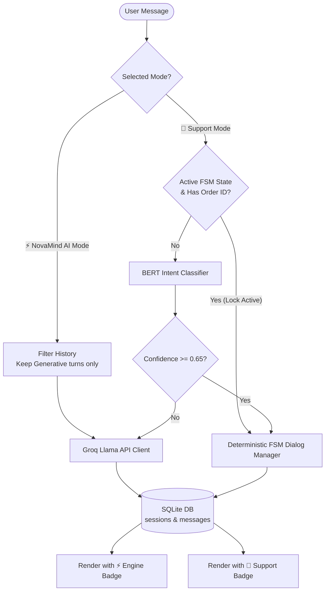

# 🌌 NovaMind: Hybrid AI & Customer Support Assistant

<p align="center">
  
  
</p>

NovaMind is a state-of-the-art, dual-personality AI chatbot system that seamlessly integrates a deterministic, context-aware customer support engine with an open-ended generative AI companion. Built with an agile microservices architecture, NovaMind features a local fine-tuned BERT model, an FSM dialog state machine, SQLite session persistence, secure enterprise API protection, and a premium cosmic glassmorphism interface.

---

## 🚀 Key Features

### 1. 🧠 Intelligent Hybrid Orchestration & Dual-Mode Personalities
* **🤖 Support Mode:** Uses a local, fine-tuned **BERT Intent Classifier** (`bert-base-uncased`) with high-confidence routing (`>= 0.65`) integrated with a deterministic **Dialog FSM (Finite State Machine)** for slot-filling (order tracking, refund handling, and cancellations).
* **⚡ NovaMind AI Mode:** A general-purpose generative AI assistant (similar to Gemini, Claude, Grok, or Perplexity) powered by the **Groq Llama Client** (Llama 3.3 70B & Llama 3.1 8B).
* **🔮 Strict Context Isolation:** In general AI mode, prior transactional support memory (e.g. order numbers, cancellation details) is dynamically filtered out. The AI companion maintains zero memory of support tasks, eliminating contextual confusion.
* **🛡️ FSM State-Lock Protection:** Prevents low-confidence intermediate intent classifications or out-of-scope banter from overwriting active slot-filling loops. Users can ask unrelated questions mid-transaction and resume support seamlessly.

### 2. 💾 SQLite Persistent Session Storage
* Replaced in-memory dictionaries with a robust, local, serverless **SQLite Database** (`history.db`) for tracking user state.
* Fully structures session metadata and conversation turns in relational tables (`sessions`, `messages`) with cascading foreign key deletions.
* Automatic JSON serialization handles dynamic slot tracking state within SQLite.

### 3. 🎨 Premium Cosmic Glassmorphism UI
* **Cosmic Midnight Theme:** An immersive deep space interface built on Vanilla CSS (`#070913`) with frosted-glass containers (`backdrop-filter: blur(20px)`), glowing neon shadows, and sleek modern typography ("Outfit").
* **Interactive Mode Controller:** A gorgeous segmented toggle in the header allowing users to slide between Support Mode and NovaMind AI Mode, complete with pulsing status indicators and dynamic avatar swaps (`🤖` vs `⚡`).
* **Tactile Interactions:** Bouncing organic typing indicators, high-intent float-up prompt suggestions cards, collapsible drawer history sidebar storing threads, and custom copyable markdown code containers.
* **Engine Badges:** Direct visual confirmation under each bot response (`🤖 Database Engine` or `⚡ Generative AI`) showing which processing module answered the query.

### 4. 🔒 Enterprise-Grade Security
* **Bearer Token Validation:** Prevents unauthorized API consumption in production via a custom `@require_api_token` decorator checking authorization headers.
* **Configurable CORS Policies:** Enforces strict whitelist domains (`ALLOWED_ORIGINS`) to prevent cross-site request forgery (CSRF) and browser-based exploits.
* **Local Fallback Bypass:** Secure token checks automatically bypass in local development if no key is configured in the environment, maintaining frictionless setup.

---

## 📐 System Architecture

The following diagram illustrates how incoming messages are parsed, validated, and routed dynamically between the local BERT Classifier, the FSM Dialog Manager, and the Groq generative API:



---

## 📂 Project Directory Structure

```text
NovaMind/
├── backend/                       # Flask API & NLP Core
│   ├── api/
│   │   └── app.py                 # Main Flask REST API & Gateway
│   ├── dialog_service/
│   │   ├── dialog_manager.py      # Transactional support FSM
│   │   ├── state_manager.py       # SQLite connection & session logic
│   │   └── history.db             # Local SQLite database file (git-ignored)
│   ├── nlp_service/
│   │   ├── intent_classifier.py   # BERT model definition & training pipeline
│   │   ├── predictor.py           # NLP inference loader
│   │   └── training_data.py       # Fine-tuning domain dataset
│   ├── tests/
│   │   └── test_api.py            # Automated Pytest suite
│   └── requirements.txt           # Python backend dependencies
├── frontend/                      # React.js SPA (Vite Client)
│   ├── src/
│   │   ├── App.jsx                # Layout, history, chat component
│   │   ├── App.css                # Cosmic Glassmorphism styling rules
│   │   └── main.jsx               # React DOM Entrypoint
│   ├── package.json               # Node packages and dev scripts
│   └── index.html                 # DOM root container
├── start.py                       # Unified process orchestrator script
├── .env.example                   # Environment configuration template
└── README.md                      # Project documentation (this file)
```

---

## 🛠️ Installation & Setup

### 1. Prerequisite Checklist
* **Python 3.11+** installed
* **Node.js 18+** & **npm** installed
* **Groq Cloud API Key** (Get yours at [console.groq.com](https://console.groq.com/))

### 2. Environment Variables Configuration
Copy the environment template from the project root and fill in your actual credentials:
```bash
cp .env.example .env
```
Open your newly created `.env` file and configure the values:
```ini
# Groq API Key for Generative Fallbacks
GROQ_API_KEY="gsk_your_actual_groq_api_key"

# Security Token (For production deployment - optional in development)
API_AUTH_TOKEN="your_secure_pre_shared_bearer_token"
VITE_API_AUTH_TOKEN="your_secure_pre_shared_bearer_token"

# Allow CORS for local dev server
ALLOWED_ORIGINS="http://localhost:5000"
```

### 3. Quickstart (Unified Orchestrator)
Boot both the React Vite development client and Flask REST backend concurrently with a single command from the project root:
```bash
python start.py
```
* **Vite Web Client:** Runs on [http://localhost:5000](http://localhost:5000)
* **Flask REST API:** Runs on [http://localhost:8000](http://localhost:8000)
* *Press `Ctrl+C` in the terminal to clean up and terminate both servers gracefully.*

---

## 🔧 Manual Setup & NLP Training

If you prefer to run or build components individually:

### Step 1: Backend Setup
1. Navigate to the backend folder:
   ```bash
   cd backend
   ```
2. Create and activate a Python virtual environment:
   ```bash
   python -m venv venv
   # On Windows:
   venv\Scripts\activate
   # On macOS/Linux:
   source venv/bin/activate
   ```
3. Install backend dependencies:
   ```bash
   pip install -r requirements.txt
   ```
4. **Train the local BERT Model:** Fine-tune `bert-base-uncased` on customer support intents:
   ```bash
   python nlp_service/intent_classifier.py
   ```
   *Model weights will save to the `backend/nlp_service/model/` directory.*
5. Start the Flask server individually:
   ```bash
   python api/app.py
   ```

### Step 2: Frontend Setup
1. Navigate to the frontend folder:
   ```bash
   cd frontend
   ```
2. Install node packages:
   ```bash
   npm install
   ```
3. Start the Vite hot-reloading development server:
   ```bash
   npm run dev
   ```

---

## 📡 REST API Specifications

All conversational and history endpoints are located under the Flask server. In production, requests require the `Authorization: Bearer <API_AUTH_TOKEN>` header.

### 1. `GET /health` or `GET /`
Returns backend health status, database connectivity, and loaded model configuration.
* **Response (200 OK):**
  ```json
  {
    "status": "healthy",
    "database": "connected",
    "bert_model": "loaded"
  }
  ```

### 2. `POST /session/new`
Generates a new UUID-based conversation session inside the SQLite memory layer.
* **Response (200 OK):**
  ```json
  {
    "session_id": "8a83d3e2-8954-4c4f-8cf8-3f81e3a936a7",
    "message": "Session initialized"
  }
  ```

### 3. `POST /chat`
Submits user input and processes it through the hybrid router.
* **Payload:**
  ```json
  {
    "session_id": "8a83d3e2-8954-4c4f-8cf8-3f81e3a936a7",
    "message": "Can you track order #45678?",
    "mode": "support_engine"  // support_engine or novamind_ai
  }
  ```
* **Response (200 OK):**
  ```json
  {
    "bot_response": "Your order #45678 is currently: Shipped. Expected delivery: 2 days.",
    "engine": "support_engine",
    "intent": "order_tracking",
    "entities": {
      "order_id": "45678"
    }
  }
  ```

### 4. `GET /history/<session_id>`
Retrieves chronological message logs for the active session, querying SQLite.
* **Response (200 OK):**
  ```json
  {
    "session_id": "8a83d3e2-8954-4c4f-8cf8-3f81e3a936a7",
    "history": [
      { "role": "user", "content": "hello", "intent": "greeting" },
      { "role": "assistant", "content": "Hello! I am NovaMind. How can I assist you?", "engine": "support_engine" }
    ]
  }
  ```

---

## 🧪 Verification & Testing

NovaMind includes a comprehensive unit testing suite using `pytest` to verify the FSM transitions, intent classifier prediction limits, hybrid router overrides, and session database isolation rules.

### Running Pytests
From the `backend` directory, run:
```bash
pytest tests/
```
*Verification targets verify 10/10 passing assertions covering database state locking, bearer token authentications, and conversation isolation tests.*