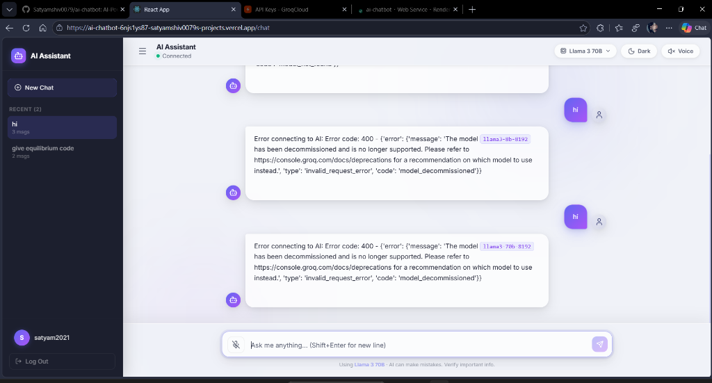
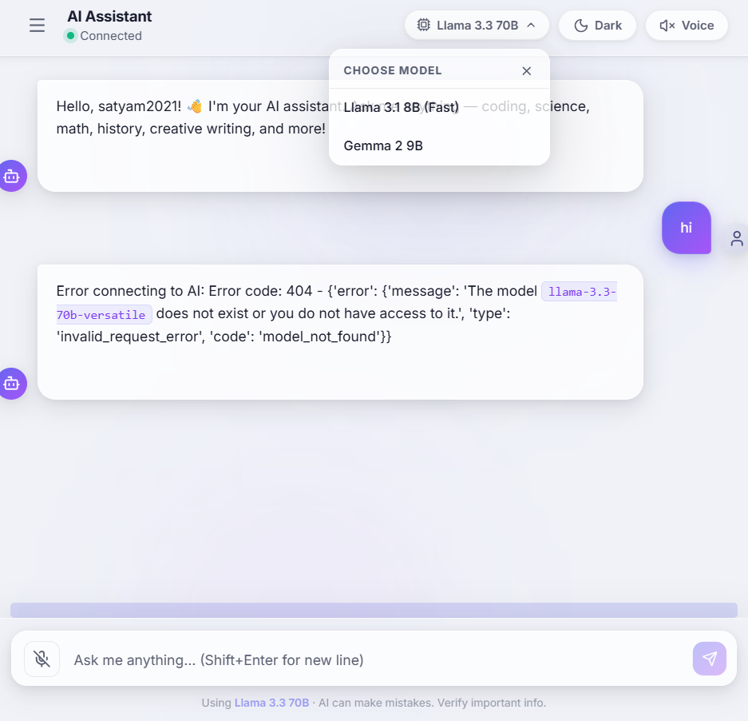
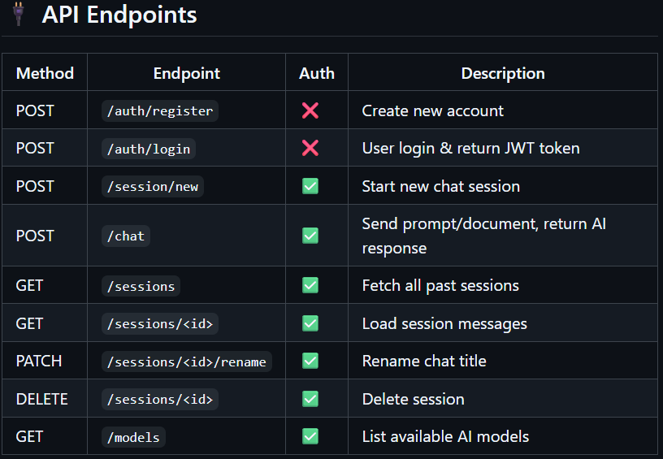

# AI Chatbot — Production RAG & Multi-Model GenAI Platform

A production-grade GenAI application combining multi-turn conversational AI with Retrieval-Augmented Generation (RAG) over user documents (PDF, DOCX, TXT). Powered by isolated FAISS vector stores, HuggingFace SentenceTransformers (`all-MiniLM-L6-v2`), LangChain orchestration, and active Groq LLM inference with automated fallback routing.

🌐 **Live Production App**: [https://ai-chatbot-6njs1ys87-satyamshiv0079s-projects.vercel.app](https://ai-chatbot-3efn0nur1-satyamshiv0079s-projects.vercel.app/login) 
⚡ **Backend API**: [https://ai-chatbot-w1x8.onrender.com](https://ai-chatbot-w1x8.onrender.com)

> Built by **Satyam**.

---

## 📸 Screenshots

| Conversational Interface & RAG Mode | Multi-Model Selection & Status | Cloud API & Session Architecture |
|:---:|:---:|:---:|
|  |  |  |

---

## 🏗️ Architecture & Dual-Mode Engine

The platform operates in two distinct, production-engineered operational modes:

```
┌────────────────────────────────────────────────────────────────────────────────────────┐
│                                 React 3D Spatial UI                                    │
│                    [ Mode A: General AI ]  |  [ Mode B: Ask My Documents (RAG) ]       │
└───────────────────────────────────────────┬────────────────────────────────────────────┘
                                            │ JWT Bearer Auth (Token verified per request)
                                            ▼
┌────────────────────────────────────────────────────────────────────────────────────────┐
│                                Flask REST API Gateway                                  │
│                 Routes: /chat, /session/*, /api/documents/*, /api/rag/query            │
└───────────────────────┬────────────────────────────────────────┬───────────────────────┘
                        │                                        │
           [ Mode A: General AI Chat ]              [ Mode B: RAG Document Q&A ]
                        │                                        │
                        ▼                                        ▼
             BERT Intent Predictor                     Document Ingestion & Parser
           (HuggingFace Transformers)                  (PDF: pypdf, DOCX: docx, TXT)
                        │                                        │
                        ▼                                        ▼
             Conversation State Manager               RecursiveCharacterTextSplitter
             (Supabase PostgreSQL / SQLite)           (Chunk size: 800, Overlap: 120)
                        │                                        │
                        ▼                                        ▼
                 Groq LLM Engine                       SentenceTransformer Embedder
             - openai/gpt-oss-20b (Fast)               ('all-MiniLM-L6-v2' 384-d dense)
             - openai/gpt-oss-120b                               │
             - qwen/qwen3.8-27b                                  ▼
             - groq/compound-mini                     FAISS User-Isolated Vector Index
             (Automatic failover routing)             (backend/vector_stores/<user_id>/)
                        │                                        │
                        │                              Similarity Search (Cosine)
                        │                                        │
                        │                                        ▼
                        │                             Strict Grounded Context Prompt
                        │                             (Zero Hallucination Guarantee)
                        │                                        │
                        └───────────────────────┬────────────────┘
                                                │
                                                ▼
                                    Groq LLM Generation
                                                │
                                                ▼
                         Grounded Response + Collapsible Source Citations
                         (Document Name, Page Number, Match %, Snippet)
```

### 1. Mode A: General AI Chat
- Multi-turn contextual conversation memory.
- Fine-tuned BERT intent prediction (`nlp_service`) for customer-service slot filling and intent tagging.
- Dynamic model switcher supporting active Groq models with seamless fallback resilience.

### 2. Mode B: Ask My Documents (RAG)
- **Document Ingestion**: Supports `.pdf`, `.docx`, and `.txt` with per-page text extraction.
- **Semantic Chunking**: LangChain recursive text splitter with 800 character chunk size and 120 character overlap to maintain context across chunk boundaries.
- **Dense Vector Embeddings**: SentenceTransformer (`all-MiniLM-L6-v2`) generating 384-dimensional normalized vectors running locally on CPU.
- **Isolated Vector Storage**: Per-user FAISS `IndexFlatIP` indices partitioned at `backend/vector_stores/<user_id>/`. Strict multi-tenant isolation guarantees zero cross-user data leakage.
- **Strict Grounded Answering**: Prompt constraints enforce that answers are derived strictly from retrieved context. If information is not in the documents, the model responds: *"I cannot find the answer to that in the provided documents."*
- **Verifiable Source Citations**: Responses return structured source metadata rendered as interactive badges in the UI displaying document name, page number, similarity percentage, and preview snippet.

---

## 🚀 Technology Stack

| Layer | Technologies |
|---|---|
| **Frontend** | React 19, Lucide Icons, ReactMarkdown, Prism Syntax Highlighter, Web Speech API (STT/TTS) |
| **Backend API** | Python 3.12, Flask 3.1, Flask-JWT-Extended, Flask-CORS, Gunicorn |
| **RAG & NLP** | LangChain, FAISS (`faiss-cpu`), SentenceTransformers, PyTorch, pypdf, python-docx, BERT |
| **Database & ORM** | SQLAlchemy 2.0, Supabase Cloud PostgreSQL with automatic SQLite fallback |
| **LLM Inference** | Groq API (`openai/gpt-oss-20b`, `openai/gpt-oss-120b`, `qwen/qwen3.8-27b`, `groq/compound-mini`) |
| **PWA & Mobile** | Service Worker (`sw.js`), Web App Manifest, responsive desktop & mobile drawer |

---

## 🔌 API Endpoints

### Authentication & Sessions
| Method | Endpoint | Auth | Description |
|---|---|:---:|---|
| `POST` | `/auth/register` | ❌ | Create new user account (bcrypt password hashing) |
| `POST` | `/auth/login` | ❌ | Authenticate user and return JWT access token |
| `POST` | `/session/new` | ✅ | Initialize new chat session |
| `GET` | `/sessions` | ✅ | Fetch all past sessions for logged-in user |
| `GET` | `/sessions/<id>` | ✅ | Load complete message history for session |
| `PATCH` | `/sessions/<id>/rename` | ✅ | Rename chat session title |
| `DELETE` | `/sessions/<id>` | ✅ | Delete session and associated messages |
| `GET` | `/models` | ✅ | List active, validated Groq AI models |

### Mode A: Conversational Chat
| Method | Endpoint | Auth | Description |
|---|---|:---:|---|
| `POST` | `/chat` | ✅ | Multi-turn conversational prompt with BERT intent classification |

### Mode B: RAG & Document Management
| Method | Endpoint | Auth | Description |
|---|---|:---:|---|
| `POST` | `/api/documents/upload` | ✅ | Upload PDF/DOCX/TXT; extracts, chunks, embeds, and indexes into user FAISS index |
| `GET` | `/api/documents` | ✅ | List all indexed documents with page counts and chunk counts |
| `DELETE` | `/api/documents/<id>` | ✅ | Delete document, remove file, and rebuild user's FAISS index |
| `POST` | `/api/rag/query` | ✅ | Grounded RAG query against user's vector store; returns answer + source citations |

---

## 💻 Local Setup & Development

### Prerequisites
- Python 3.10+ (tested on Python 3.12)
- Node.js 18+
- Free [Groq API Key](https://console.groq.com)

### 1. Backend Setup

```bash
cd backend

# Create & activate virtual environment
python -m venv venv
venv\Scripts\activate       # Windows
# source venv/bin/activate  # macOS/Linux

# Install dependencies
pip install -r requirements.txt

# Configure environment variables (.env)
cp .env.example .env
# Edit .env with your GROQ_API_KEY and JWT_SECRET_KEY

# Run automated tests
pytest tests/

# Start Flask API server
python api/app.py
```

### 2. Frontend Setup

```bash
cd frontend/chatbot-ui

# Install dependencies
npm install

# Start development server
npm start
```
Open [http://localhost:3000](http://localhost:3000) in your browser.

---

## 🧪 Automated Testing

The project includes unit, integration, and security tests:

```bash
# Run all tests
pytest backend/tests/ -v

# Run RAG test suite (document processing, FAISS isolation, grounded generation)
pytest backend/tests/test_rag.py -v

# Run API test suite (JWT protection, chat, sessions)
pytest backend/tests/test_api.py -v
```

---

## 📜 License

MIT License. Built by Satyam.
